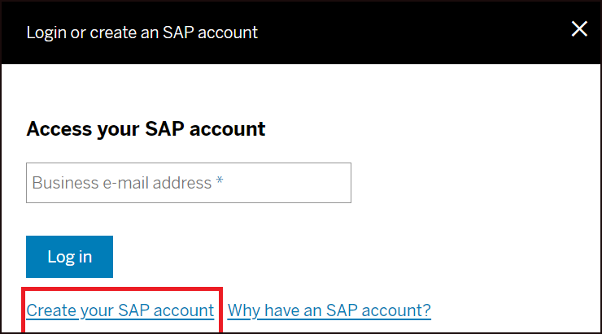
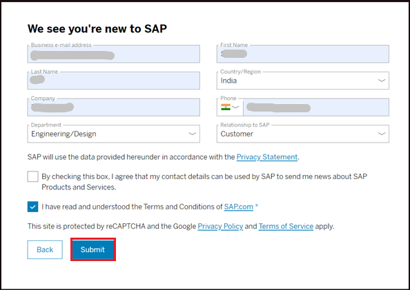
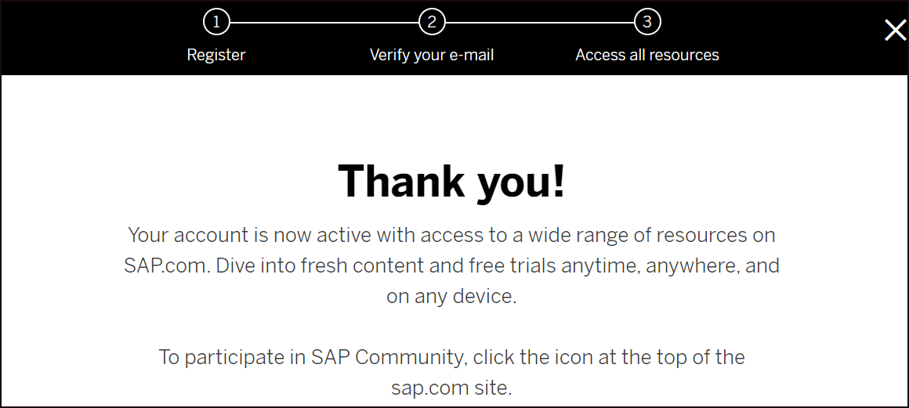
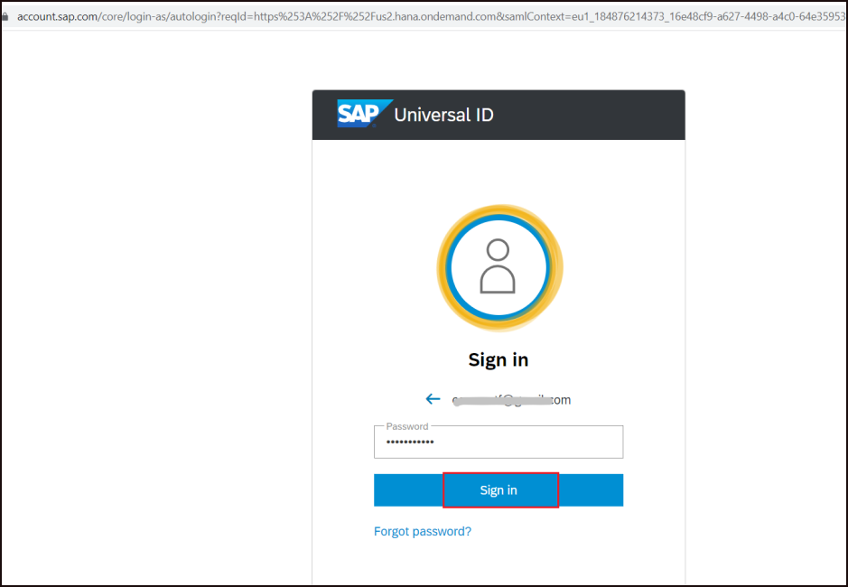
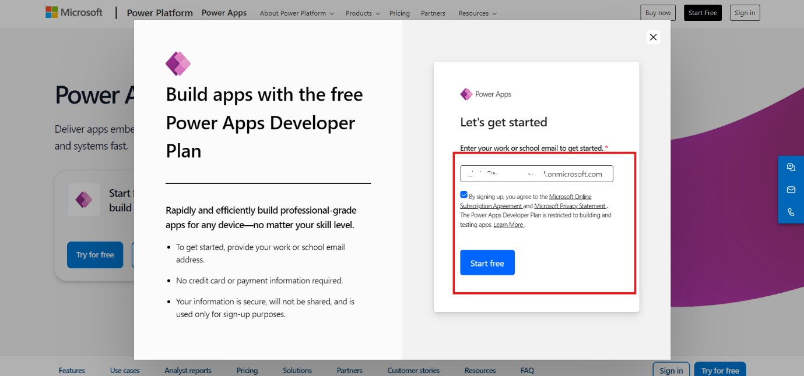
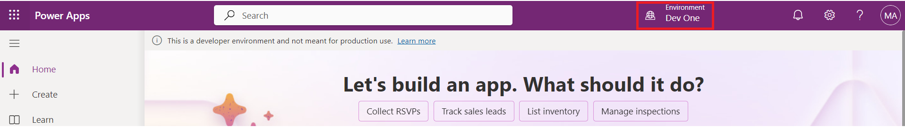

# Setting up Lab Environment

<table>
<colgroup>
<col style="width: 21%" />
<col style="width: 78%" />
</colgroup>
<thead>
<tr>
<th>Objective </th>
<th>
In this lab, participants will take on the role of an IT
Administrator at <strong>Contoso</strong>, tasked with enabling
collaboration and app development for a project team. You'll assign a
Power Apps trial license to a new developer, setting up a development
environment, and create a dedicated Microsoft Teams space, complete with
channels, for seamless project communication and collaboration. This
hands-on lab will help you understand how to provision access to Power
Apps and manage team collaboration in Teams effectively.

 
</th>
</tr>
</thead>
<tbody>
<tr>
<td>Prerequisites </td>
<td>
To complete this lab, you need a Microsoft 365 admin tenant, a
Power Apps trial license, a Microsoft Teams trial license, and access to
the Power Platform admin center. Ensure all necessary licenses and
access permissions are in place before starting.

 
</td>
</tr>
<tr>
<td>Duration </td>
<td>30 mins </td>
</tr>
<tr>
<td>Version </td>
<td>1.0 </td>
</tr>
<tr>
<td>Publication date  </td>
<td>October 2024 </td>
</tr>
</tbody>
</table>

 
 

# Task 1: Assign Power Apps trial license

- Open a web browser and go to
  <https://powerapps.microsoft.com/en-us/free/>.

  

- Select **Start free**.

  

- Enter your **Office 365 admin credential**, check the checkbox to
  **accept the agreement** and click on **Start your free trial.**

  

- Enter **password of your** **Office 365 tenant Id** and then select
  **Sign in.**

  

- Select **Yes** on **Stay signed in?** pop-up window.

  

- Provide **Contact Information** as below and then select **Submit.**

  - **Email:** Office 365 admin tenant credentials

  - **Country/region**: United States

  - **Phone number**: Your phone number

  

- You can now see **Home page of Power Apps**. From the environment
  selector, select the developer environment – **Dev One** which is
  created for you.

  

- Open the new tab and go to Power Platform admin center by navigating
  to <https://admin.powerplatform.microsoft.com> and if required, sign
  in using your given Office 365 tenant admin credentials. **Close**
  **the Pop-up window** saying, ‘Welcome to the Power Platform admin
  center’.

  

- From the left navigation pane, select **Environments** and then you
  can see, **Dev One** is your Dataverse environment.

  

# Task 2: Create a team in Microsoft Teams 

- Sign in to Microsoft Teams using <https://teams.microsoft.com/> with
  your Office 365 tenant credentials.

- Close the pop-up window.

  

<table>
<colgroup>
<col style="width: 100%" />
</colgroup>
<thead>
<tr>
<th>
<strong>Note:</strong> If pop-up asks you to switch to the new
Teams, select Switch now and follow the below instructions a and b.

<ul>
<li>
window, select <strong>Get Started.</strong>
</li>
</ul>

<ul>
<li>
Close the window which is asking for scanning QR code.
</li>
</ul>

</th>
</tr>
</thead>
<tbody>
</tbody>
</table>

- In the Sidebar on the left, click **Teams**, click on **+ icon** to
  join or create a team.

  

- Click on **Create team.**

  

- For old Teams, select **From a scratch**. If you have switched to new
  Teams, follow the below steps a, b and c and directly go to the step
  8.

  

- Enter the Team name – Test Team. Click on Private.

  

- Select Org-wide.

  

- Select **Create** and go to step 8 directly.

  

- Select **Org-wide** for What kind of team this will be?

  

- Give a **Name** to your team as **Test Team** and click **Create.**

  

- To create a channel within this team, select the team **Test Team**
  that you created, click **More options … \\ Add channel.**

  

- Give a name to the Channel as **"TestChannel",** select the channel
  type as **Standard** and then click **Add/Create.**

  

- You can view the channel in teams when added.

  
