# Connecting to an SAP ODATA API and Updating SAP data from a canvas app

<table>
  <colgroup>
    <col style="width: 21%" />
    <col style="width: 78%" />
  </colgroup>
  <thead>
    <tr>
      <td style="text-align: left;">Description</th>
      <td style="text-align: left;">
        This lab provides hands-on experience with integrating SAP and Power Platform by guiding participants 
        through key exercises such as setting up an SAP account, creating a custom OData connector, building a 
        Power Apps canvas app, adding a Power Automate flow, and invoking the flow to update product information. 
        Participants will learn how to access and work with SAP data through Power Apps and Power Automate, 
        leveraging OData connections to automate and streamline business processes.
      </th>
    </tr>
  </thead>
  <tbody>
    <tr>
      <td style="text-align: left;">Prerequisites</td>
      <td style="text-align: left;">
        To get the most out of this lab guide we recommend you have a School or Work Email ID, 
        Microsoft 365 admin tenant ID, Power Apps trial license, and Power Automate trial license.
      </td>
    </tr>
    <tr>
      <td style="text-align: left;">Duration</td>
      <td style="text-align: left;">1 hour</td>
    </tr>
    <tr>
      <td style="text-align: left;">Version</td>
      <td style="text-align: left;">1.0</td>
    </tr>
    <tr>
      <td style="text-align: left;">Publication date</td>
      <td style="text-align: left;">October 2024</td>
    </tr>
  </tbody>
</table>

 
 

# Exercise 1: Create an SAP Account

## Task 1: Create an SAP Account

- Log into the SAP website at <https://www.sap.com> and click on the
  admin button.

  

- Click on **Create your SAP account.**

  

- Fill in your details, select the checkbox for accepting the terms and
  conditions and click on **Submit**.

  

- You will get the **Check your email and finalize your account**
  screen.

  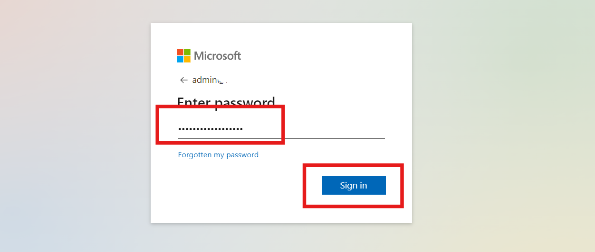

- Open the email from the sender **SAP Universal ID - Notification** in
  your registered mailbox and click on **Click to activate your
  account.**

  

- On the next screen, create and confirm the password, select the check
  box to acknowledge the SAP Universal ID Terms of Use and then click on
  **Submit**.
  
  

  > **Note:** Make a note of this username and password for future use to access the SAP related pages.

- You will land on the **Thank You** page.

  

- Close the Thank You screen.

## Task 2: Create an account for Gateway Demo System

- Open <https://register.sapdevcenter.com/SUPSignForms/> from your
  browser. Enter your email id (the one that you provided during the SAP
  id creation) and click on **Continue**.

  

- Provide the SAP login password and then click on **Sign In**.

  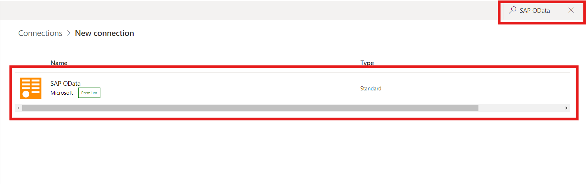

- Click on **Accept**.

  

- You will be taken to the SAP Gateway Demo Server page with the login
  details to the system.

- Select the check box to accept the Terms and conditions and then click
  on **Register**.

  

- Click on Show password to view the password.

  

- Check the mailbox and open the mail from <devcenter@sap.com>. Open the
  Login to the SAP Gateway WebGUI link from the email.

  

- Login using the login details from the email.

  

- Change the password and click on **Change**.

  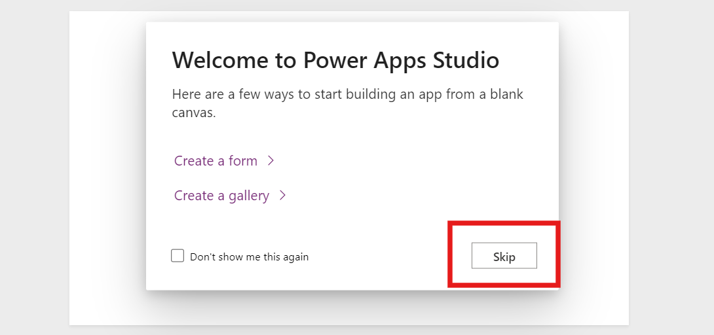

  >**Note:** Make a note of this **User id** and **Password**. This will be
the login credentials for your SAP Demo system.

- Click on **Continue**.

  

- You will get a successfully logged on screen.

  

- Click on the **Fiori Launchpad** link. This is the Fiori Launchpad
  home page, which will be your gateway to the SAP Demo System.

  

# Exercise 2: Create a Custom Connector (OData connection)

## Task 1: Sign Up for Microsoft Power Apps 

 

- Open your web browser and go to the
  <https://powerapps.microsoft.com/free/> page. 

<!-- -->

- On this page, locate the **Try free** button and click on it to begin
  the sign-up process. 

  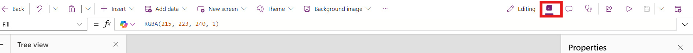

- Under the "Let's get started" section, you'll see a text box labelled
  **Enter your Microsoft 365 admin credential or Work-School Email Id**.

<!-- -->

- After entering your **ID**, check the agreement box to agree to the
  terms and conditions. 

<!-- -->

- Click on **Start free** to proceed. 

  
 

- If you receive a prompt stating that you already have a Microsoft
  account associated with the entered email address, select **Sign in**.
  Enter your same **ID and Password** when prompted. 

<!-- -->

- After signing in, you may be prompted with an option to stay signed
  in. Select **Yes** to stay signed in for quicker access in the
  future. 

  

- Once you're signed in, look at the top-right corner of the screen.
  Choose the environment **Dev One.** This is important for the next
  steps, as you’ll need to select this environment when working in Power
  Apps. 

## Task 2: Create Power Apps Custom OData Connector

- Select **Dev One** environment.

  

- From the left pane, click on the **More** and then select **Discover
  all**.

  

- Scroll down the Discover all connection and click on **Custom
  connectors** under **Data**.

  

- On the Custom connector page, click on **+ New custom connector** and
  then select the **Import from Github** option.

  

- Select the following details in the Import from Github pane.

<!-- -->

- **Connector Type - Custom**

- **Branch – dev**

- **Connector – SAP-ODATA-Demo**

  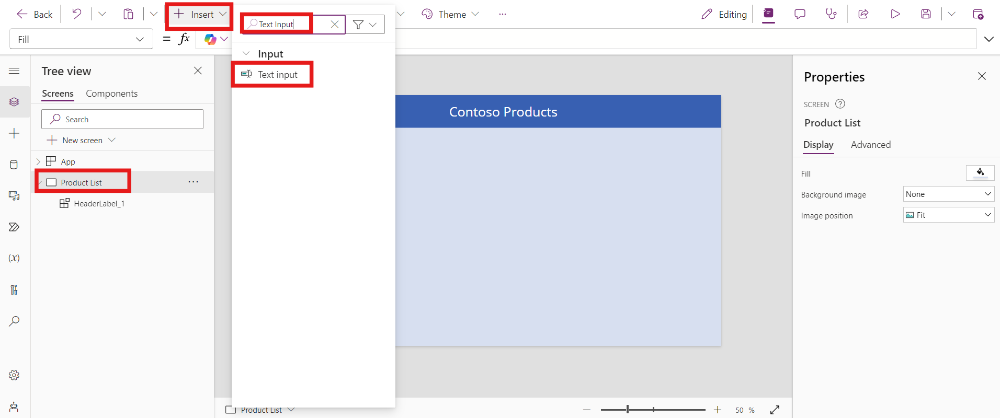

- In the SAP-ODATA-Demo page, you can see the URL of the demo system as
  in the screenshot below.

  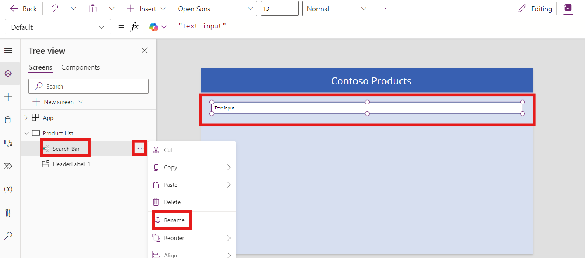

- Select **2.** **Security** from the drop down and then select **Edit**

  

- Select **Basic authentication**.

  

  > **Note:** The username and password will be the login details of your gateway demo system which we will have to provide later.

- The next screen **(3. Definition),** shows the available Actions with
  the connector.

  

- The URL shows the path to the ProductSet.

  

- Click on **Create Connector**.

  

- Once created, the **Create connector** option gets changed to **Update
  connector**.

  

# Exercise 3: Create the Canvas App and Power Automate Flow

## Task 1: Create Canvas Power App

- From the Power Apps home page, select **Apps** from the left pane and
  select **Import apps.**

  

- Download power apps with the help of GitHub link
  <https://github.com/microsoft/PowerPlatformConnectors/blob/master/custom-connectors/SAP-ODATA-Demo/SAP%20EPM%20Products%20Demo%20Starter.msapp>
  .

  

- In Import app click on the **From File (.msapp)**, browse app file and
  import the app.

  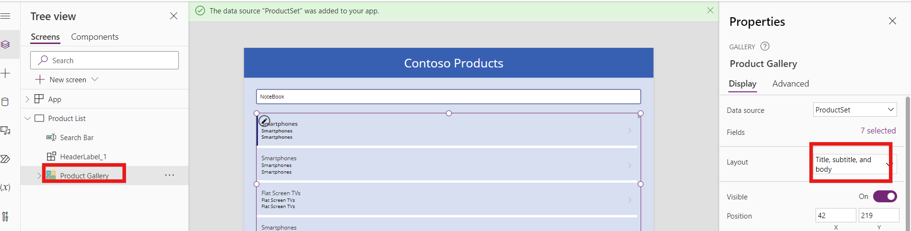

- The imported app is look like given below, the app has got multiple
  errors since we have not connected to the SAP through ODATA yet.

  

- From the left pane, select **Data** then click on **+ Add data**.
  Search for OData and then select **SAP-ODATA-Demo** from it.

  

- Provide the login credentials of your Demo Gateway system. Click on
  **Got it** under the Premium dialog.

  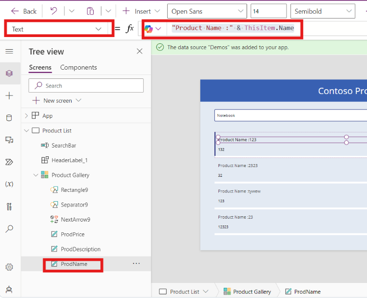

  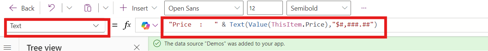

- Once the connection is made, all the errors except for one would have
  been resolved. Click on **Gallery3** from Tree view. Select
  **Advanced** tab from the **Gallery** Pane.

  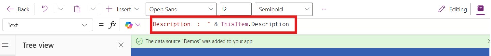

- Select the formula under **DATA -\> Items**. Replace the formula with
  the below one.

  >SortByColumns(zProducts, "Name")

  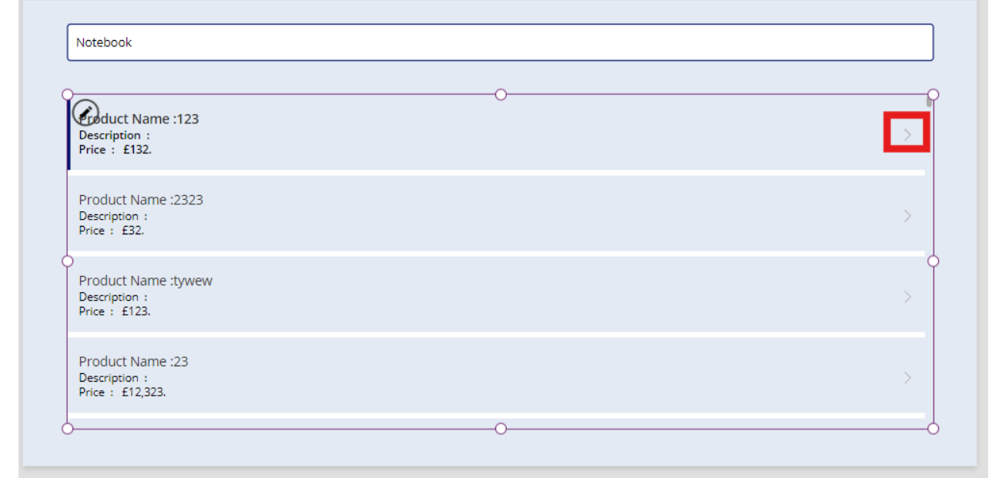

- Save the app and click on the **Play** button.

  

- Click on **Refresh icon** of the Products on the app. Here, we can
  find the list of all the products from the demo SAP System, that we
  browsed through the Fiori launchpad.

  

- Click on any item to view their values on the right-side pane. The app
  is now without any errors.

  > 

- Click on **10” Portable DVD player** from the Products list. Do some
  update to the Price and click on the Tick mark. When clicked, we get
  an error message,

  TODO: Fix the “OnSelect” formula to invoke a flow. This is because, we have not defined UpdateButton yet.

  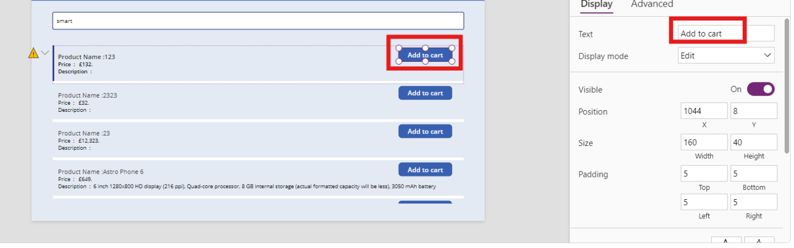

- From top right corner close the app.

  

## Task 2: Add a Power Automate flow

- Select the **Power Automate** button from the left pane and then
  select **Create new flow**.

  

- On the Create your flow pane, select **+ Create from blank.**

  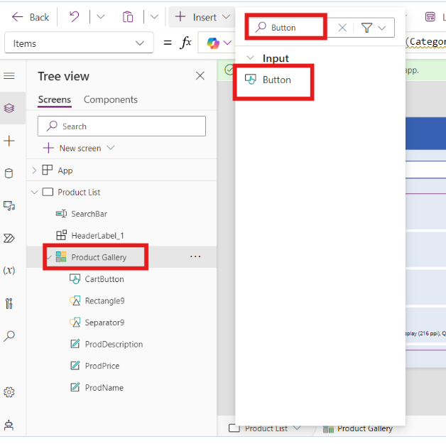

- The flow pane gets opened click on **PowerApps(V2)**. Select **+ Add
  an input** \> **Text**.

  

- Enter the name as **ProductID**.

  

- Similarly, add the following as in the screenshot below.

  | **Property** | **Data Type** |
  |--------------|---------------|
  | Name         | Text          |
  | Description  | Text          |
  | E-Tag        | Text          |
  | Price        | Number        |
  
    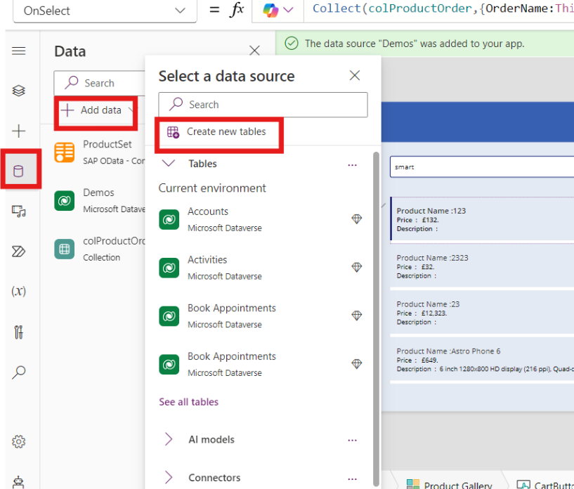

- Rename the flow as **UpdateProduct** and then click on **+ New step**.

  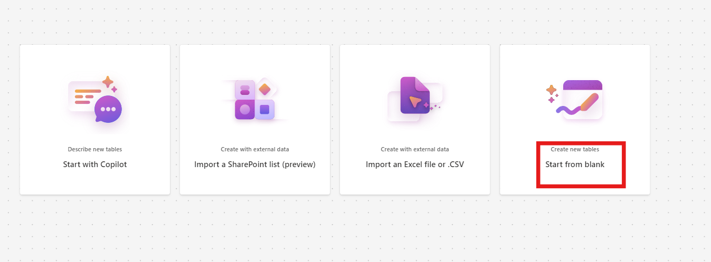

- In the New step, select **Custom** under choose an operation and then
  select the **SAP-ODATA-Demo**.

  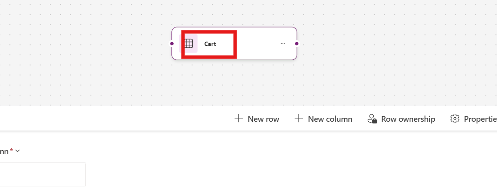

- Enter the SAP ES5 Username and Password and click on **Create**.

  

- Select **Get product** from the SAP-OData-Demo.

  

- Under Get product, type **HT-2000** in the ID field and select
  **fetch** under x-csrf-token and then select **+ New step**.

  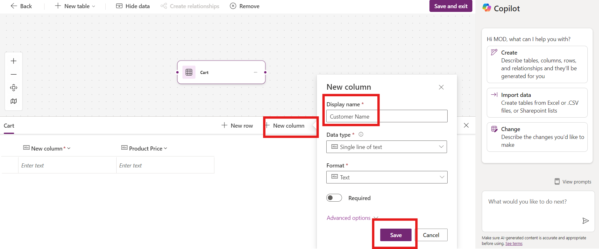

- In the New step, select **Customer \> SAP-O-DATA** and then select
  **Update product**.

  

- Once added, select the **Product ID** field and select the **Product
  ID** that we added under the trigger, Power Apps(V2).

  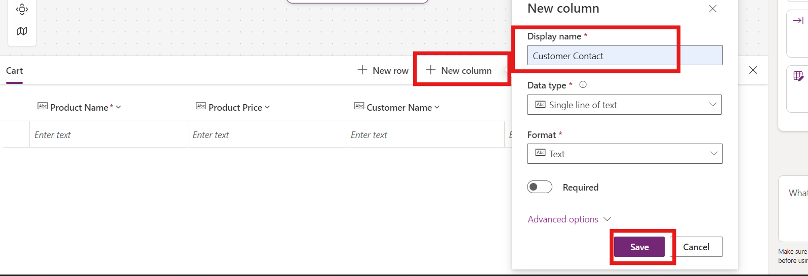

- For the x-csrf-token, add **x-xsrf-token**.

  

- For **x-ms-cookie-header,** click on the Expression tab and then paste
  the below content.

  >replace(outputs('Get_product')\['headers'\]\['Set-Cookie'\],',',';')

  

- Select the values for the Properties as below.

  | **Property** | **Value**                   |
  |--------------|-----------------------------|
  | E-Tag        | PowerApps(V2) – E-Tag       |
  | Name         | PowerApps(V2) - Name        |
  | Description  | PowerApps(V2) - Description |
  | Price        | PowerApps(V2) - Price       |
  |              |                             |
  
    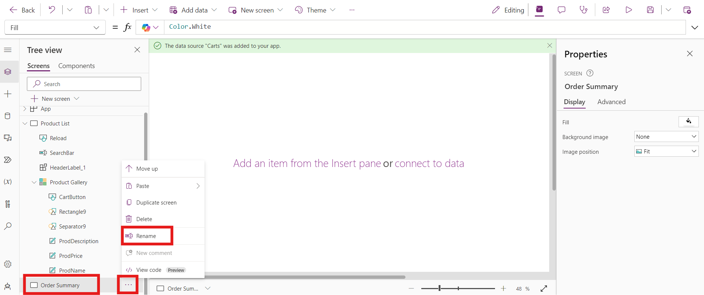

- From the top bar click on **Save** button.

  

- Once saved, click on the **Close** button.

  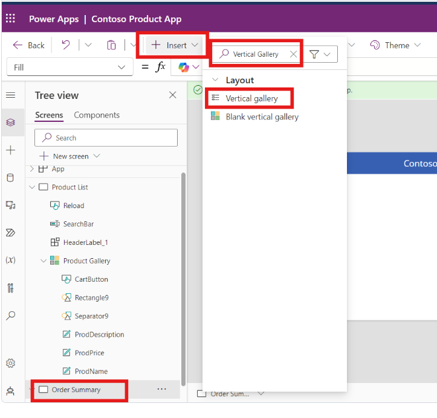

## Task 3: Invoke the flow

- Back in the Power Apps screen, you will see that the flow is now added
  to the app.

  

- Got to components click on the tick button and go to Advanced option,
  In Advanced option enter the below given formula in OnSelect.

  >UpdateProduct.Run(*ProductBox*.Product.ProductID,*ProductNameTB*.Text,*DescriptionTB*.Text,*ProductBox*.Product.\_\_metadata.etag,*PriceTB*.Text)

  

- Click on **Save** and then click on the **Screens** tab under the
  **Tree view**.

  

- Click on **Play**.

  

- Select the product, **10” Portable DVD player.** Change the Price on the right-side pane of the app as **349.99** from 449.99. Click on the **Tick Mark (UpdateButton)**. This action should trigger the **UpdateProducts** Power Automate flow.

  

# Exercise 4: Check the flow

- Go to the Power Automate page at <https://make.powerautomate.com/>

- Click on **My flows** and select **UpdateProducts**. Under the 28-day
  run history, you can find the flow that you just triggered and find
  that the flow has succeeded.

  

- Open the link of the Fiori launchpad
  <https://sapes5.sapdevcenter.com/sap/bc/ui5_ui5/ui2/ushell/shells/abap/FioriLaunchpad.html#Shell-home>
  from the browser. Select the **Manage Products** tile.

  

- Click on **Go** and observe that the Price of the Product 10” Portable
  DVD player has been updated from 449.99 to 349.99.

  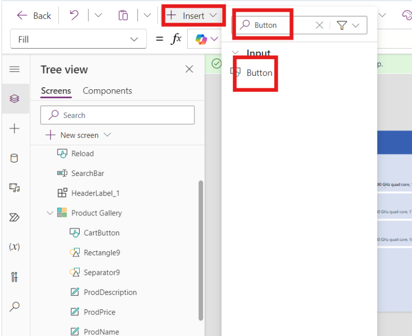
