# SAP and Microsoft Teams Integration with Copilot and Generative AI

<table>
<colgroup>
<col style="width: 21%" />
<col style="width: 78%" />
</colgroup>
<thead>
<tr>
<th>Description </th>
<th>
In this lab, participants will start by creating an SAP account
and setting up a Gateway Demo System to access SAP services. The next
step involves configuring Microsoft Copilot Studio and creating a
Copilot with generative AI capabilities tailored for SAP product
integration. Participants will then create Power Automate flows for
querying product information from SAP and updating product prices. These
flows will be integrated with the Copilot, allowing users to interact
with SAP through Microsoft Teams. Finally, the lab will conclude with
testing the Copilot within Teams by retrieving product information and
updating product prices, followed by verification of the updates in the
SAP system.

 
</th>
</tr>
</thead>
<tbody>
<tr>
<td>Prerequisites </td>
<td>
To get the most out of this lab guide we recommend you have Work
or school Email ID-Password, Microsoft copilot Trial License, Microsoft
Teams Trial Licence, Microsoft Power Automate trial license.

 
</td>
</tr>
<tr>
<td>Duration </td>
<td>1 hours </td>
</tr>
<tr>
<td>Version </td>
<td>1.0 </td>
</tr>
<tr>
<td>Publication date  </td>
<td>October 2024 </td>
</tr>
</tbody>
</table>

 
 

# Exercise 1: Create SAP Account

## 

## Task 1: Create SAP Account

- Log into the SAP website at <https://www.sap.com> and click the
  **admin** button.

  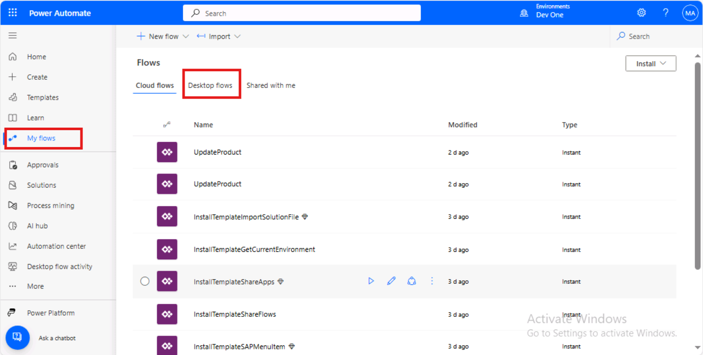

- Click on **Create your SAP account.**

  

- Fill in your details, select the checkbox for accepting the terms and
  conditions and click on **Submit**.

  

- You will get the **Check your email and finalize your account**
  screen.

  

- Open the email from the sender **SAP Universal ID - Notification** in
  your registered mailbox and click on **Click to activate your
  account.**

  

- On the next screen, enter the password, select the check box to
  acknowledge the SAP Universal ID Terms of Use and then click on
  **Submit**.

  

  > **Note:** Make a note of this username and password for future use to access the SAP related pages.

- You will land on the **Thank You** page.

  

- Close the Thank You screen.

## Task 2: Create an account for Gateway Demo System

- Open <https://register.sapdevcenter.com/SUPSignForms/> from your
  browser. Enter your email id (the one that you provided during the SAP
  id creation) and click on **Continue**.

  

  

- Provide the SAP login password and then click on **Sign In**.

  

- Click on **Accept**.

  

- You will be taken to the SAP Gateway Demo Server page with the login
  details to the system.

- Select the check box to accept the Terms and conditions and then click
  on **Register**.

  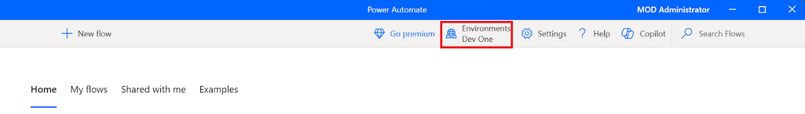

- Click on **Show password** to view the password.

  

- Check the mailbox and open the mail from <devcenter@sap.com>. Open the
  Login to the **SAP Gateway WebGUI** link from the email.

  

- Login using the login details from the email.

  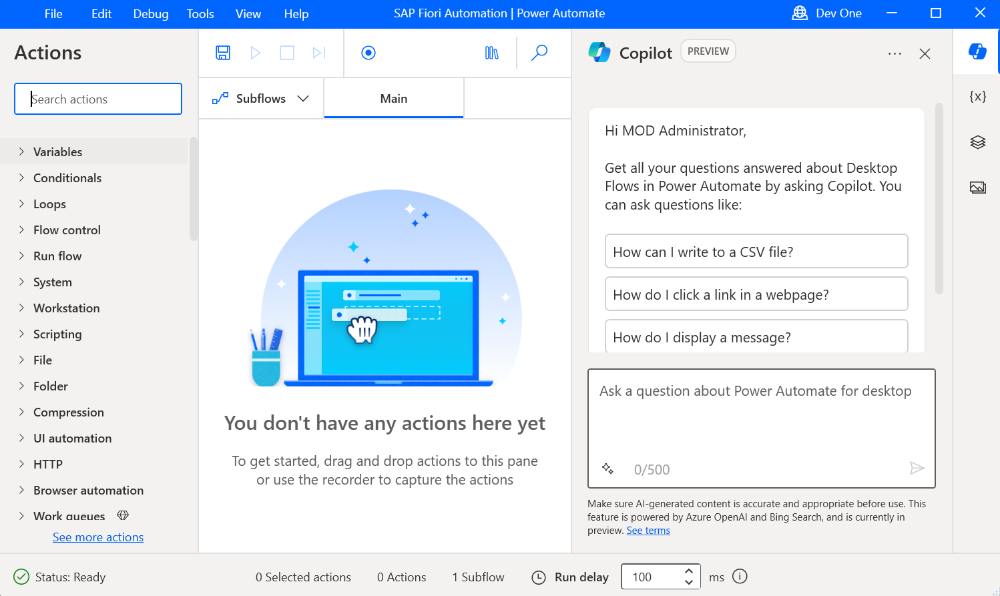

- Change the password and click on **Change**.

  

> **Note:** Make a note of this **User ID** and **Password**. This will be the login credentials for your SAP Demo system.

- Click on **Continue**.

  

- You will get a successfully logged on screen.

  

- Click on the **Fiori Launchpad** link. This is the Fiori Launchpad
  home page, which will be your gateway to the SAP Demo System.

  

# Exercise 2: Create and Configure Copilot

## Task 1: Login in Copilot studio

- Navigate to
  <https://www.microsoft.com/en-us/microsoft-copilot/microsoft-copilot-studio>
  and click on **Sign in** button.

  

- Enter the login **admin tenant login ID / Work-School ID** and click
  on the Next. For this lab we use **Admin tenant ID and Password.**

  

- Enter the **Admin tenant Password** and click on the **Sign In**
  button.

  

- Select **yes** for stayed sign in with credential.

  

## Task 2: Create a Copilot with Gen AI Capabilities

- Opne Copilot studio and from top environment sections select **Dev
  One** environment.

  

- Click on the **Create** button form the left navigation bar and then
  select **New Copilot** option.

  

- Click on the **Skip to configure** and start manual configuration of
  copilot.

  

- Enter the following details in the respected fields and click on the
  **Create** button.

  - **Name:** SAP Product Copilot

  - **Description:** The Copilot allows you to integrate SAP system and
    fetch product information live from SAP and update price of
    products.

  - **Instructions:** The copilot has to check the available product in
    SAP system and provide the product information as per the
    requirement and update the price of the product.

  

- Click on the **Setting** form the top right corner and then select
  **Generative AI** option. In Generative AI setting select **Generative
  AI (Preview)** and select **Medium** content moderation. After the
  configuration click on the save button.

  

# Exercise 3: Create Power Automate Flow for SAP Integration

## Task 1: Create Power Automate Flow for Product Information

- Then go back to overview section of copilot and select **Actions**
  from the top bar. After click on actions select **Add an action**
  button to create a new SAP action.

  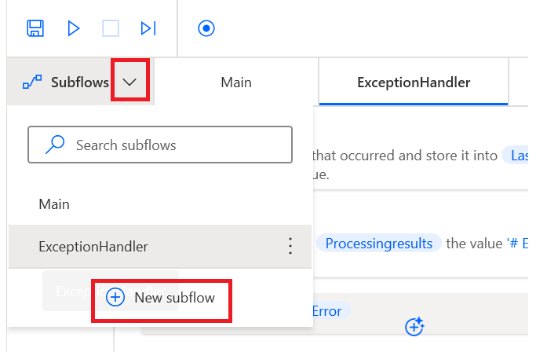

- Scroll down select **Choose an action section** and click on **Create
  a new flow** button, it will redirect to power automate flow.

  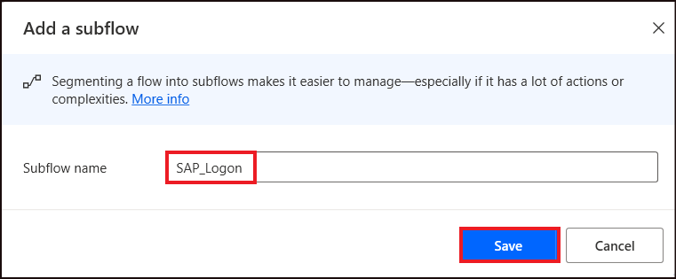

- From top left corner rename the flow as **SAP Product Category**.

  

- Click on the **Run a flow from copilot** and select **+ Add an
  input**.

  

- In **+ Add an input** option select **Text** as type of input.

  

- Enter **Product Input** in the input section.

  

- Click on the **+** sign and select **Add an action** option.

  

- In Add an action section enter **SAP OData** and select **Query OData
  entities.**

  

- Enter the following Details in the Create a new connection section and
  then click on the **Create new button**.

  - **Connection Name:** SAP-Product-100

  - **Authentication Type:** Basic

  - **OData Base URL:**
    <https://sapes5.sapdevcenter.com/sap/opu/odata/iwbep/GWSAMPLE_BASIC>

  - **User Name:** Enter the ES5 SAP User ID which we created in
    exercise 1 task 2.

  - **Password:** Enter the ES5 SAP Password which we created in
    exercise 1 task 2.

  

- In **OData Entity Name** select **Productset** and then click on
  **Show all.**

  

- In **\$Top** section enter **10,** which will return top 10 product.

  

- Click on the **Respond to Copilot** option and click on **Add an
  output** option.

  

- Select **Text** as type of output.

  

- Enter **Product Output** as output name and then enter the
  **string(body('Query_OData_entities'))** as the value of the output
  with the help of function. Click on the Add button after enter the
  output query.

  

- **Save** and **Publish** the copilot.

  

- Go back to copilot studio and click on the **Refresh**.

  

## Task 2: Create Power Automate Flow for Update Product

- On the **Choose an action** window scroll down and click on the
  **Create a new flow.**

  

- Rename the Flow Name as **Update Product Price.**

  

- Click on the **Run a flow from copilot** and then select **+ Add an
  input.**

  

- Select the type of user input as **Text**.

  

- Rename the input name as **Product ID.**

  

- Then again click on the + Add an input, select **Number** as input
  type and rename the input as **Update Price.**

  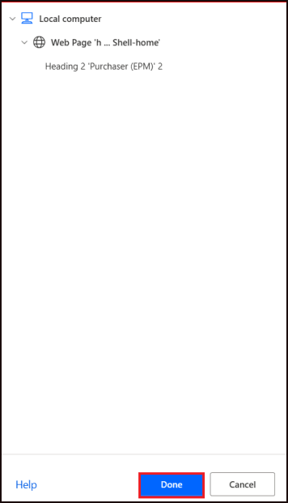

- Click on the **+** Icon and select **Add an action.**

  

- Enter **SAP OData** in the Add an action search bar and click on **see
  more**.

  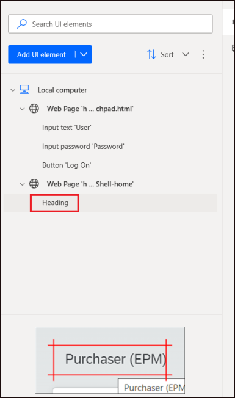

- Click on the **Update OData entity**. After click on the entity, it
  will connect automatically with SAP OData Connection which we create
  in **SAP Product Category** flow.

  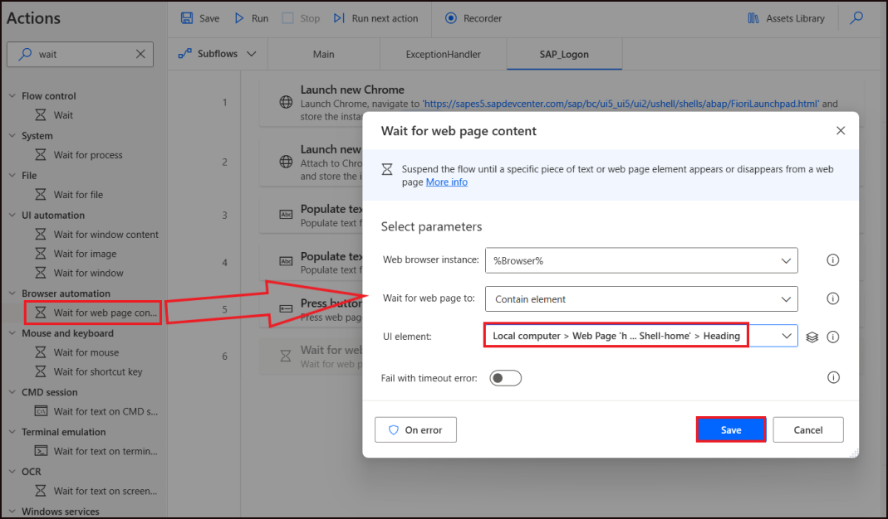

- Click on the OData Entity Name and select **ProductSet.**

  

- In the ProductID sections select **ProductID** with the help of
  dynamic content.

  

- Click on the **Advanced parameters** and select **Price**.

  

- In the price parameter enter **Update Price** with the help of dynamic
  content.

  

- Click on the **Save and draft** and then click on **Publish**.

  

# Exercise 4: Integrate Power Automate Flow with Copilot

## Task 1: Integrate SAP Product Category Flow

- Go back to copilot studio window and click on the **Refresh** button.

  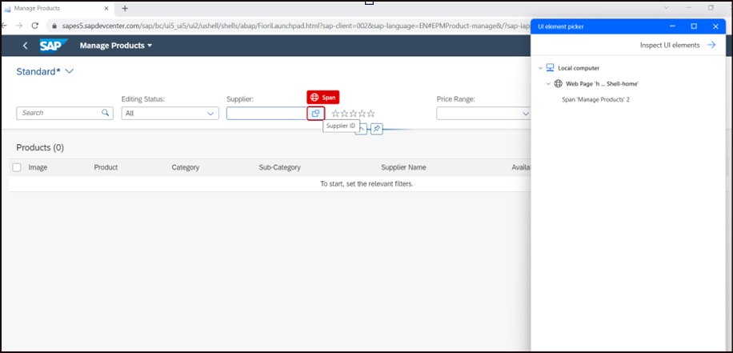

- Scroll down choose an action window and select **SAP Product
  Category** flow.

  

- Click on the next button.

  

- In the Input Parameter click on the edit input button and add the
  description as given below and the click on save button.

**Description:** Product Category. One of the following categories can
be used. The name has to be exactly like this: Accessories, Notebooks,
Laser Printers, Mice, Keyboards, Mousepads, Scanners, Speakers,
Headsets, Software, PCs, Smartphones, Tablets, Servers, Projectors, MP3
Players, Camcorders.

  

  

- Click on the outputs and then select edit outputs.

  

- Enter the given below given description and click on the save button.

**Description:** List of SAP products for a provided product category.
Return the result as table including following information: ProductID,
Category, Name, Description and Price.

  

- Click on the **Next** button and after that click on the **Finish** to
  complete the configuration.

  

  

- Go to action section and the select the SAP Product Category action.

  

- Go to **Output** section and check the box **Respond to the user after
  running this action**. After check the box click on the save button.

  

- Click on the Test Button place as the top right side and enter the
  prompt Notebooks in the respected field. It will return the connect
  request. Click on the connect to give the permission. After select
  connect, it will redirect to connection window.

  

- In Manage your connections window click on the connect button.

  

- Click on the three dots on SAP OData and select **SAP-Product-100**
  connection. After selecting the connection click on the Submit button.

  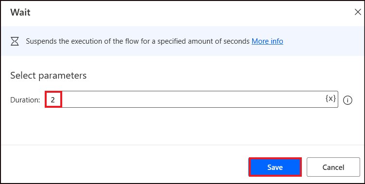

- Flow is shown as connected in the Manage connections.

  

## Task 2: Create topic Product Update

- Go to topic for the top bar and click on the **Add new topic** and
  then click on **From** **blank**.

  

- Rename the topic as **Product Update**.

  

- In the trigger node, Enter the below given description.

Update Product, Update Product Price, Update Price, Price Update

  

- Below trigger node, add **Message Node.**

  

- Enter the message in the Message Node which is given below.

Thank you for using our service. Please enter **Product ID** and
**Update Price** in below given card.

  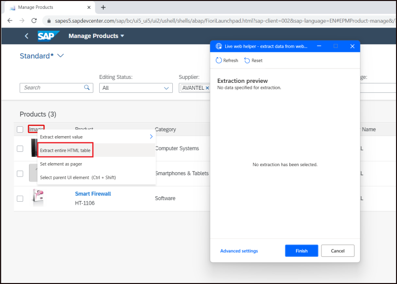

- Click on the + Sign below message node and add Ask with adaptive card
  node.

  

- Click on the three dots on adaptive card and click on the properties.

  

- Enter the below give code in the properties window and close the
  properties.

""

{

"type": "AdaptiveCard",

"\$schema": "http://adaptivecards.io/schemas/adaptive-card.json",

"version": "1.3",

"body": \[

{

"type": "Input.Text",

"placeholder": "Placeholder text",

"id": "1",

"label": "Product ID"

},

{

"type": "Input.Number",

"placeholder": "Placeholder text",

"id": "2",

"label": "Updated Price"

},

{

"type": "ActionSet",

"actions": \[

{

"type": "Action.Submit",

"title": "Submit"

}

\]

}

\]

}

""

  

- Below adaptive card output section is available, in output **section
  1** variable click on select a variable and then click on the create
  new, a new variable **Var1** is created.

  

- Repeat same process for next output Var2 is created.

  

- Go to variable from the top and select all right side check box for
  all variable.

  

- Below adaptive card, click on + sign and select call an action, then
  select **Update Product** flow.

  

- In the Action select Var1 for Product ID and Var2 for Update Price.

  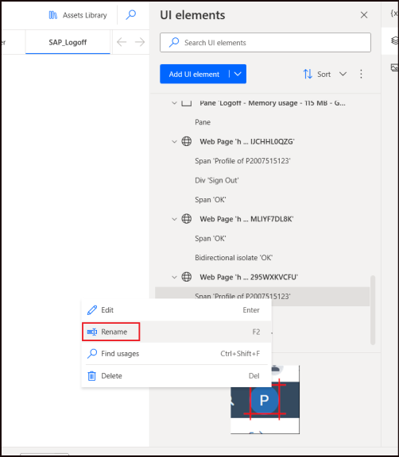

  

- Below Action node, click on + sign and add Message node, in message
  node enter the flowing message. **Product Var1 price is updated.
  Thankyou.** Replace Var1 with Variable name Var1 with the help of {x}
  button.

  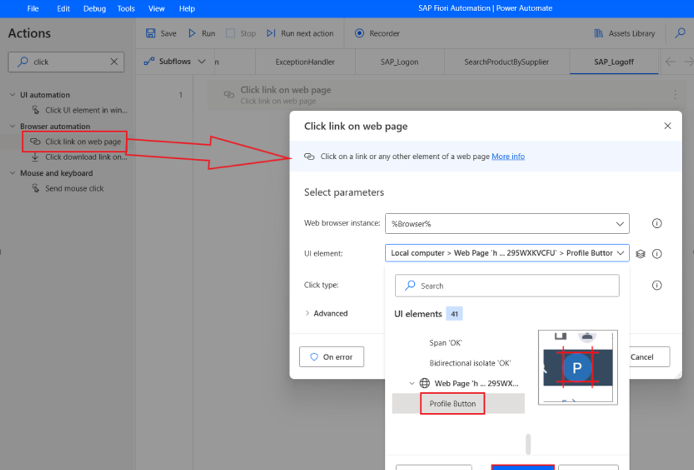

- Click on the Test button and enter the prompt Update Price. Then fill
  the Product ID (HT-1001) and price (1540), click on submit. After
  click on submit a message show to connect. Click on the connect.

  

- It will navigate to other window which manage the connections. Click
  on the connect button of Update Product Price.

  

- Click on the three dots and select connection SAP-Product-100 then
  click on submit button.

  

- After the completing it shows connected.

  

- Click on the publish button to save the copilot setting

  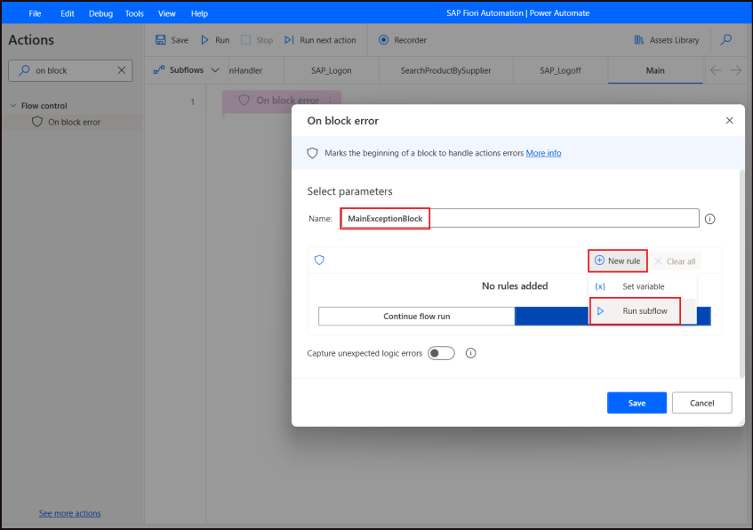

# Exercise 5: Integrate Copilot with SAP

- Go to Channels from the top bar which is placed next to Analytics and
  then click on **Microsoft Teams**.

  

- Then click on the **Turn on Teams** button.

  

- Now teams are connected successfully, now click on the **Open
  Copilot** a new window will open.

  

- On the new window click on the Use the web app instead.

  

- Now Teams app web app will open, click on the **Add** button to add
  the copilot. And then the chat bot is ready.

  

# Exercise 6: Test Copilot in teams.

- Open teams app and enter the prompt **Give me information about
  Notebooks.**

**Note:** If prompted Additional permissions are required to run this
action. To proceed, please select 'Connect', and review any missing
connections. Click on connect and apply the same steps as we perform
before. After connection created back to teams and then type prompt
again.

  

- It returns the information of the Notebooks from SAP System.

  

- Then give another prompt, I want to update price of product.

  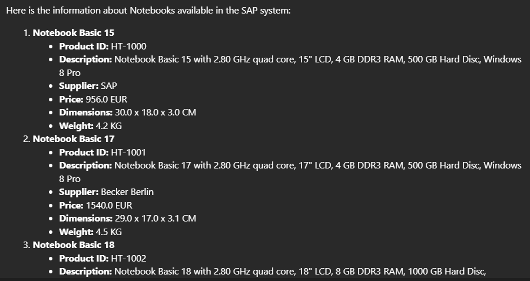

- Now it returns the adaptive card, enter Product ID HT-1001 and in
  price enter 1111 and then click on the submit.

  

**Note:** If prompted Additional permissions are required to run this
action. To proceed, please select 'Connect', and review any missing
connections. Click on connect and apply the same steps as we perform
before. After connection created back to teams and then type prompt
again.

- After entering the Product ID and Price confirmation message appears.

  

- To confirm the updation, go to <https://sapes5.sapdevcenter.com/> ,
  click on Fiori Launch, login with your User Id and Password, Click on
  manage product. Then in search bar type HT-1001 and then click go.

  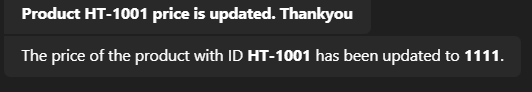

- Now see the updated price of the product is 1111.

  
